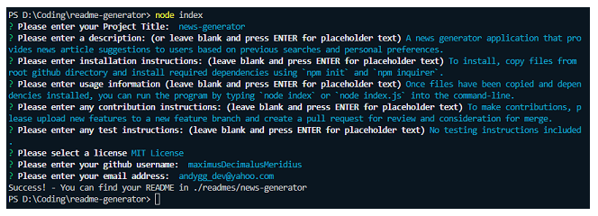
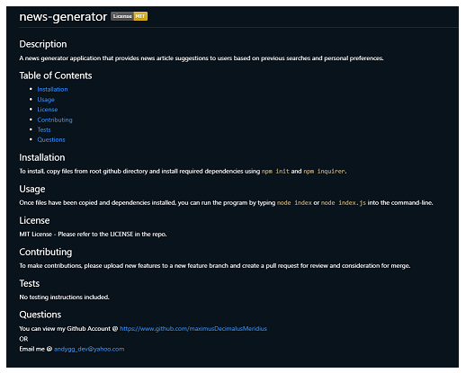

# readme-generator 

## Description

This is a class project focused on demonstrating proficiency with node and node libraries such as inquirer.  It takes several inputs from a user regarding their project and then generates a README file based on those inputs.  The file is then output in the readmes directory, and placed in a directory with the same name as the project title.

This challenge presented several problems that required knowledge of js, node, and asynchronous coding.  In addition to learning more about the aforementioned topics, I also had an opportunity to dive into the structure of READMEs and start thinking about future development opportunities like important thumbnails, linking to external resources, and adding additional style.

## Table of Contents

- [Installation](#installation)
- [Usage](#usage)
- [License](#license)
- [Questions](#questions)

## Installation

To install, download all files in the github repo.  You'll need to `npm init` and `npm install inquirer@8.2.4` in order to pull in the required libraries.  Then run with node via the command line and enter any requested information.

## Usage

Run via the command line with `node index.js` and enter required information.  Once you see success in the console, you can find your README file in the readmes directory under the file folder with the same project title.

***You can view the technical walkthrough on YouTube @ [https://youtu.be/UzrF78QIxRo](https://youtu.be/UzrF78QIxRo)

### Thumbnail of the user interaction via CLI  

### Thumbnail of the formatted, output README.md  

## License

MIT License - Please refer to the LICENSE in the repo.

## Questions

You can view my Github Account @ https://www.github.com/maximusDecimalusMeridius  
OR  
Email me @ [andygg_dev@yahoo.com](mailto:andygg_dev@yahoo.com?subject=Question%20About%20readme-generator%20App)
    